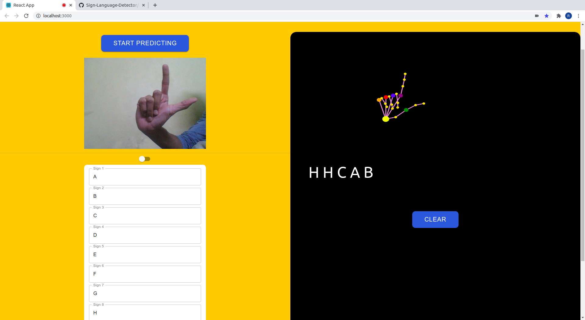
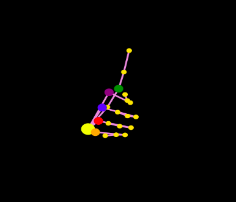
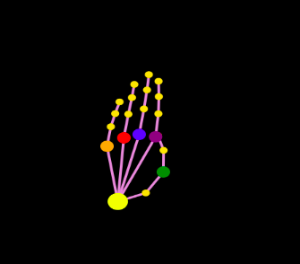
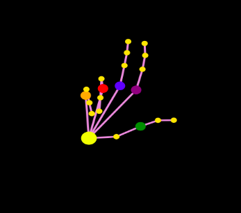
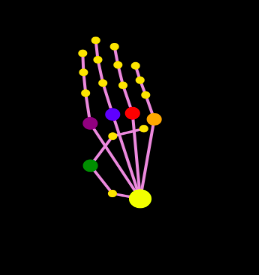
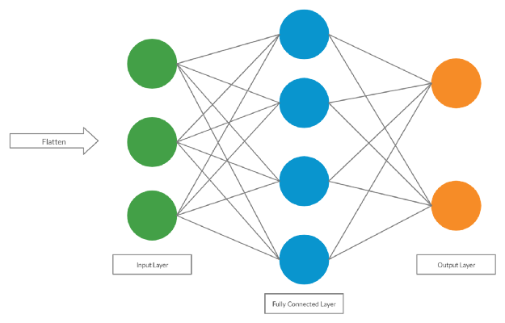

# Multi Purpose Sign Language Detector
We have used eight alignments of the hand to map to any functionality. Currently we have the option of mapping to specific labels or map to some link. This is essentially enforcing a new way of user navigation using handsigns. We have only used eight alignments and not covered the whole alphabet so as to get more accurate results with the training data available to us. With eight signs there is very less probability of vectors of two hand signs to be similar. 

There can be many usecases and automation chances for such a application for example 
1. Mapping the signs to some home functionality like turning the light one, turning fan off etc. 
2. Making a map to most used applications or links and navigate to them using the hand alignments.
3. Playing simple multiplayer games. 
4. Making a page navigation usign the hand alignments. 
5. Creating weird music 
and many more.

## Working

The application implements two of the following above possiblities:
1. Map the hand alignments to labels and make a sentence
2. Map the hand alignments to links and open the link on the browser on detection.

The signs used are given as follows:

1. 
2. 
3. 
4. 
5. 
6. 
7. 
8. 

## Concepts
The concepts used here were the basics of image/video processing as well as deep learning and CNN's to classify the image dataset.
1. Image representation

A particular image is represented as a 3-D array with h*w*d dimensions. In a RGB image d is 3 which means there are 3 channels red,green & blue. Each channel has a 2-D 
representation which means what amount of colour(3rd dimenion) is present at a particular region(denoted by 2-dimension). 

2. Deep learning

Deep learning (also known as deep structured learning) is part of a broader family of machine learning methods based on artificial neural networks(ANN's) with representation     learning. An ANN is based on a collection of connected units or nodes called artificial neurons, which loosely model the neurons in a biological brain. Each connection,         like the synapses in a biological brain, can transmit a signal to other neurons. An artificial neuron that receives a signal then processes it and can signal neurons connected to it. The "signal" at a connection is a real number, and the output of each neuron is computed by some non-linear activation function of the sum of its inputs. The connections are called edges. Neurons and edges typically have a weight that adjusts as learning proceeds. The weight increases or decreases the strength of the signal at a connection. Neurons may have a threshold such that a signal is sent only if the aggregate signal crosses that threshold. Typically, neurons are aggregated into layers. Different layers may perform different transformations on their inputs. Signals travel from the first layer (the input layer), to the last layer (the output layer), possibly after traversing the layers multiple times. 

So basically the image undergoes various transformations in each layer and finally a vector is produced which will help in classifying the objects.
At each layer all the neurons are multiplied with the weight matrix and the non-linear activation function here is 'Leaky-Relu'.

3. Convolution layer

Convolution is the first layer to extract features from an input image. Convolution preserves the relationship between pixels by learning image features using small squares of input data. It is a mathematical operation that takes two inputs such as image matrix and a filter or kernel.

Consider a 5 x 5 whose image pixel values are 0, 1 and filter matrix 3 x 3 as shown in below

Then the convolution of 5 x 5 image matrix multiplies with 3 x 3 filter matrix which is called “Feature Map” as output shown in below

Convolution of an image with different filters can perform operations such as edge detection, blur and sharpen by applying filters. The below example shows various convolution image after applying different types of filters (Kernels).

4. Strides

Stride is the number of pixels shifts over the input matrix. When the stride is 1 then we move the filters to 1 pixel at a time. When the stride is 2 then we move the filters to 2 pixels at a time and so on. The below figure shows convolution would work with a stride of 2.

5. Padding

Sometimes filter does not fit perfectly fit the input image. Also many a times when we do convolution for a number of layers a lot of information is lost, since the image size
diminshes after each layer. So We have two options:
Pad the picture with zeros (zero-padding) so that it fits
Drop the part of the image where the filter did not fit. This is called valid padding which keeps only valid part of the image.

6. Relu function

In the project Relu function is used as activation function.

7. Pooling Layer
Pooling layers section would reduce the number of parameters when the images are too large. Spatial pooling also called subsampling or downsampling which reduces the dimensionality of each map but retains important information. Spatial pooling can be of different types:
* Max Pooling
* Average Pooling
* Sum Pooling
Max pooling takes the largest element from the rectified feature map. Taking the largest element could also take the average pooling. Sum of all elements in the feature map call as sum pooling.

8. Fully-Connected Layers

Now we move on to the fully connected layer. Here’s where the classification happens. The matrix is first flattened into a vector and then passed through a neural net. The neural net it passes through is similar to an Artificial Neural Net in that it passes the vector through, applying weights and biases finally ending up with a classification. The CNN classifies the image by using a softmax activation function which gives the probability the input is from a certain class.

## Dataset Processing
The data was prepared in a brute-force manner by us ourselves & with help of little data augmentation. The data is organized into 26 folders with 10700 pictures in all folders for each letter of the alphabet.The program takes all the classes & randomly distributes it into 10,000 images for training & 700 for testing. The training is further divided into 80% actual training & 20% validation. In addition, to speed up training I down-scaled all the pictures in the data-set to 48x48 from 200x200.

## Covolutional and Pooling Layers
4 convolutional and pooling layers were used in this model. For each layer, 5 actions are performed:
In the first line, the number of filters and filter size is defined. For the first layer, 64 3x3 filters are used. The input size of the image is also defined here as 48x48.

After the matrix undergoes convolution, forming a feature matrix, it passes through batch normalization. This reduces the shift of hidden layer values. This makes training easier because it stabilizes the weights, improving accuracy.

We next run it through a Re-LU function. This brings some non-linearity to the layer, allowing the CNN to understand the complicated pictures inputted.
The next line is where pooling occurs. We have defined the pooling filter size as 2x2, and are using max-pooling. This reduces the matrix size even more.

Finally, the matrix is passed through a dropout layer. What the dropout layer does is it randomly drops nodes that exist in the neural net. The benefit of dropping the nodes is that net becomes less sensitive to each individual node’s weights. This allows the net to be more generalized in it’s predictions, improving accuracy. In the model used, we drop 25% of the existing nodes which will be replaced by new ones in the next layer.

The output of the first convolutional layer now becomes the input of the next layer. The matrix has already gotten smaller, but by passing it through more layers it becomes even smaller, showing only the key parts of the photo necessary for classification. These steps happen 4 times, the only thing changing is the filter size and number of filters used during convolution.

## Fully-Connected Layers
After convolution, it’s time for the fully-connected layers. But before that happens, the data is flattened into a single column vector.
Now that the data can pass through the neural net, a dense layer is used. A dense layer is pretty much the neural net. It passes the input from the previous steps and outputs all of it to it’s neurons. The neurons are connected and pass data from one to the next layer. In this case, there are 256 neurons.
Then, it goes through batch normalization.
Then a ReLU function is used for activation.

Finally, 25% of the nodes are once again dropped out using dropout.

There are two fully connected layers, so the code repeats with 512 nodes.

Once past the second fully connected layer, the output is put through a softmax function which is used to give the probability the image belongs to one of the 26 classes.

The last few lines set the learning rate and evaluate the accuracy of the model.

## Training
Now that we have defined the model, we have to train it. Training the model is where the CNN comes to life. Training is where the question of “what are the weights for the filters and fully connected layers?” is answered. A CNN uses backpropagation to define the weights for all the layers. Backpropagation consists of four steps: forward pass, loss function, backwards pass and finally weight update.

1) The Forward pass consists of the image going through the model. At first, all the weights and biases are randomized, so the classification is also randomized. This is because the model and specifically the filters do not know how to identify the edges and features of the images.

2) The classification accuracy is represented in the loss function. The loss function tells you how well your model categorized each image. It compares the predicted label of the image with the actual label of the training image. In our case, categorical crossentropy was used as the loss function.

3) Next, is the backwards pass which identifies which weights caused the loss function to be high.

4) When those weights are identified, the weights are updated such that the loss decreases. The learning rate specifies how much the weights can be changed. Eventually, the goal is to have the predicted label match up all the time with the actual label of the picture.

## Available Scripts

In the project directory, you can run:

### `yarn start`

Runs the app in the development mode. 
Open [http://localhost:3000](http://localhost:3000) to view it in the browser.

The page will reload if you make edits. 
You will also see any lint errors in the console.

### `yarn test`

Launches the test runner in the interactive watch mode. 
See the section about [running tests](https://facebook.github.io/create-react-app/docs/running-tests) for more information.

### `yarn build`

Builds the app for production to the `build` folder. 
It correctly bundles React in production mode and optimizes the build for the best performance.

The build is minified and the filenames include the hashes. 
Your app is ready to be deployed!

See the section about [deployment](https://facebook.github.io/create-react-app/docs/deployment) for more information.

### `yarn eject`

**Note: this is a one-way operation. Once you `eject`, you can’t go back!**

If you aren’t satisfied with the build tool and configuration choices, you can `eject` at any time. This command will remove the single build dependency from your project.

Instead, it will copy all the configuration files and the transitive dependencies (webpack, Babel, ESLint, etc) right into your project so you have full control over them. All of the commands except `eject` will still work, but they will point to the copied scripts so you can tweak them. At this point you’re on your own.

You don’t have to ever use `eject`. The curated feature set is suitable for small and middle deployments, and you shouldn’t feel obligated to use this feature. However we understand that this tool wouldn’t be useful if you couldn’t customize it when you are ready for it.
